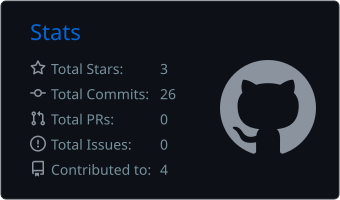
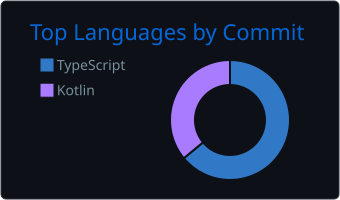
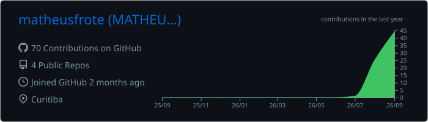

<!-- ====================================================== -->
<!-- MATHEUS FROTE — GITHUB PROFILE README                  -->
<!-- ====================================================== -->

 

---

## 👨‍💻 Sobre mim

Sou profissional de **Data Analytics**, com experiência transformando dados de marketing, mídia e negócios em análises, automações, dashboards e recomendações para tomada de decisão.

Minha atuação combina **análise de dados, Business Intelligence, marketing analytics e desenvolvimento de soluções orientadas por dados**.

Atualmente também venho desenvolvendo aplicações utilizando **Inteligência Artificial como parte do processo de engenharia e desenvolvimento**, explorando produtos que unem dados, automação, modelagem estatística e experiência do usuário.

Tenho interesse especial em:

- 📊 Data Analytics & Business Intelligence
- 🧠 Data Science & Machine Learning
- 🤖 Inteligência Artificial aplicada a produtos
- 📈 Marketing Analytics & Growth
- ⚙️ Automação e pipelines de dados
- 🧪 Experimentação e análise estatística
- 🚀 Desenvolvimento de aplicações orientadas por dados

---

## 🧰 Tecnologias

### Data Analytics & Data Science

  

### Desenvolvimento

  

### Marketing & Growth

---

# 🚀 Projetos em destaque

<table>
<tr>
<td width="50%" valign="top">

## 📊 Easy Mix Modeling

Plataforma para **Marketing Mix Modeling (MMM)** voltada à análise da contribuição dos canais de marketing sobre resultados de negócio.

O projeto busca transformar dados históricos de investimento e performance em informações úteis para **mensuração, simulação e otimização de orçamento**.

### Principais recursos

- Marketing Mix Modeling
- Budget Optimizer
- Simulação What-If
- Curvas de resposta
- ROI por canal
- Importação e mapeamento de dados
- Múltiplos canais de marketing
- Interface web para análise dos resultados

### Stack

`Python` `Flask` `React` `Node.js`  
`MySQL` `Prisma` `Docker` `Statistics`

 

</td>

<td width="50%" valign="top">

## 💰 Custo de Vida

Aplicação em desenvolvimento que transforma o preço de produtos e serviços em uma métrica mais intuitiva:

### **quantas horas de trabalho aquilo custa?**

O objetivo é permitir que o usuário visualize o impacto de uma compra não apenas em reais, mas também em **tempo de trabalho necessário para gerar aquele valor**.

### Conceitos explorados

- Finanças pessoais
- Conversão salário → tempo
- Visualização de custos
- UX orientada à simplicidade
- Desenvolvimento assistido por IA
- Aplicação responsiva

 

> 🚧 Projeto atualmente em desenvolvimento.

</td>
</tr>

<tr>
<td width="50%" valign="top">

## ⚡ Elétrica Curitiba

Aplicação web desenvolvida para apresentação digital de serviços na área elétrica.

O projeto foi desenvolvido com foco em:

- Responsividade
- Performance
- Experiência mobile
- Estruturação de serviços
- Conversão de visitantes
- Presença digital

 

</td>

<td width="50%" valign="top">

## 📈 Data Analytics Portfolio

Repositório dedicado aos meus projetos, estudos e aplicações relacionadas a:

- Data Analytics
- Business Intelligence
- SQL
- Python
- Visualização de dados
- Estatística
- Marketing Analytics
- Data Science

 

</td>
</tr>
</table>

---

# 📊 GitHub Analytics

---

# 🔥 Streak

---

# 📈 Activity Graph

---

# 🐍 Contribution Snake

<picture>
  <source
    media="(prefers-color-scheme: dark)"
    srcset="https://raw.githubusercontent.com/matheusfrote/matheusfrote/output/github-contribution-grid-snake-dark.svg"
  />
  <source
    media="(prefers-color-scheme: light)"
    srcset="https://raw.githubusercontent.com/matheusfrote/matheusfrote/output/github-contribution-grid-snake.svg"
  />
  
</picture>

---

# 🌐 Vamos nos conectar

  

### Dados não servem apenas para explicar o passado.

**Eles ajudam a decidir o que fazer a seguir.**

 

